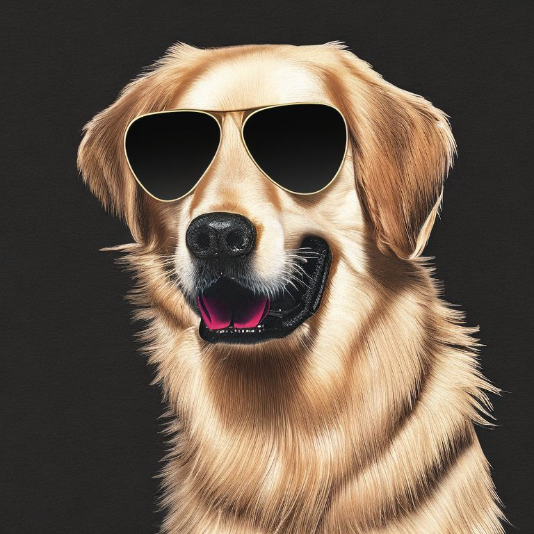
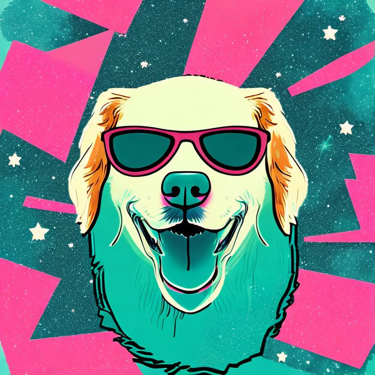

# stable-discovery

This is my personal framework for creative **exploration and exploitation of Stable Diffusion - at scale**.

The framework allows one to randomly mix and match ideas for prompts.
Instead of manually fiddling with prompts one can generate 10,000 images, screen for favourites and find out what works/doesn't - at scale.  

For code examples & requirements, scroll further down.


## Elevator Pitch - Why spend time on this repo?

I'm using this for 3 primary objectives:

1. **Exploration - getting inspiration for creative images**
    - Mixing and matching prompts & seeds to generate e.g. 5000 images and see what the model has to offer
2. **Exploitation - honing in on prompts & configs**
    - Fine-tuning of prompts, seeds, and hyper-parameters to converge towards what I like/had in mind
3. **Tracking Experiments** 
    - I use this iteratively, but have found myself often forgetting exactly which configuration I ran with 5 iterations ago. No more, as this framework kind-of forces one to keep the configurations (with unique names) 

In practice, you write a list of possible combinations of subjects, actions and 
suffixes (e.g. styles) - and let the model do its thing overnight. 
The following day, you scroll through the images and find out what worked and what did not.


### Examples

<table cellspacing="0" cellpadding="0" 
style="border-collapse: collapse; border: none; width: 67%; margin: auto">
  <tr style="border: none;">
    <td style="border: none;"></td>
    <td style="border: none;"></td>
    <td style="border: none;"></td>
  </tr>
  <tr style="border: none;">
    <td style="border: none;"></td>
    <td style="border: none;"></td>
    <td style="border: none;"></td>
  </tr>
  <tr style="border: none;">
    <td style="border: none;"></td>
    <td style="border: none;"></td>
    <td style="border: none;"></td>
  </tr>

</table>

The above images were created with this configuration (although I didn't generate 10k images, I stopped after ~500 in this case):

```json
{
  "subjects": ["a Golden Retriever wearing sunglasses"],
  "actions": [
    "walking on a tropical beach", "floating in space", "floating in space with galaxies in the background",
    "floating in space with the moon in the background", "black background", "grey background", "white background"
  ],
  "suffixes_1": ["vector graphics", "art deco"],
  "suffixes_2": [],
  "suffixes_3": ["teal and pink - synthwave style", "teal and pink"],
  "steps": [40, 50, 60],
  "num_configs": 10000,
  "generator_seed": 1338
}
```

The "generator-configuration" is the core of the framework, and it is the way that one sets up (and tracks) experiments.

Each generated image is made by sampling from the values in the configuration.


The configuration contains 4 types of data:

* `subjects`, `actions`, and `suffixes_X` are all the possible parts of the final prompt. 
For each image created, one random sample will be taken from all of these, 
and the prompt will be constructed like:
  * `final_prompt = subject + action (+ suffix_1 (+ suffix_2 (+ suffix_3)))` (i.e. suffixes are optional)      
* `steps` is the number of DDIM steps taken by the diffusion model
* `num_configs` is the number of images you want to generate
* `generator_seed` is the seed for the random sampling of prompts and number of steps

## Getting Started

1. Install the necessary packages
2. Run the script [generate_en_masse.py](/src/main/executables/examples/generate_en_masse.py)
    * It's only 4 lines, and I believe that I have named things reasonably, so no further introduction will be given
3. Start experimenting!

Below are the contents of [generate_en_masse.py](/src/main/executables/examples/generate_en_masse.py):
```python
def _main():
    experiment_name = "golden-glasses-synthwave-01"  # This is the name of your config under ".../data/generator-configs/{experiment_name}.json"
    generator_config = PromptGeneratorConfig.init_from_json_file(CoreConfig.get_generator_configs_dir() + f'{experiment_name}.json')
    configs: List[StableDiffusionConfig] = ConfigGenerator.generate_configs_v1_a(generator_config)
    ImageGenerator.generate(configs=configs, output_dir_relative_path=experiment_name)
```

### Requirements

The workhorse of this repository is [Stable Diffusion v2-1 from HuggingFace.co](https://huggingface.co/stabilityai/stable-diffusion-2-1).

I have provided the repository with the file [environment.yml](/environment.yml) for Anaconda.
I don't recommend cloning the environment, as the environment is bloated with a lot of things irrelevant for this repo. 

## The Future


### Statistics on best prompts
I won't guarantee anything, but one idea I have is to build 
a statistics/analytics tool. 
Imagine that you have created 10k images, and you select your 100 favourites.
Since we have a log of the prompts used to generate the images, 
one can compute the frequency of which `subject`/`action`/`suffix` 
is more likely to generate a winning image.
Thereby potentially helping one hone in on good prompts and, 
by extension, generate more good images. 
